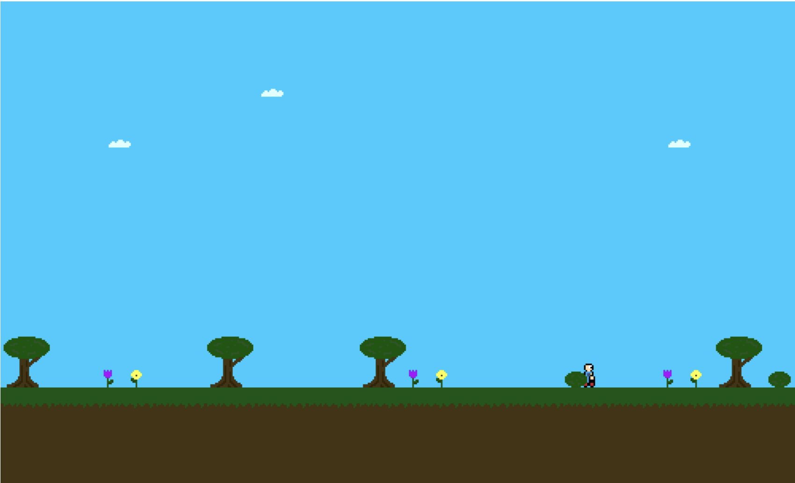
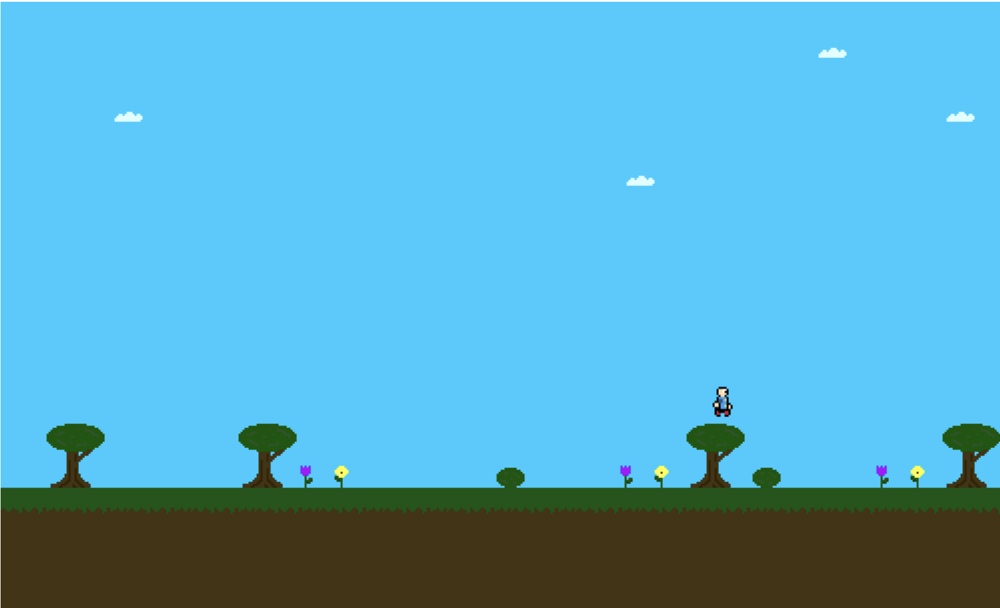

# Platformer

This is a simple game, intended as an example of a object-oriented, tile-based game. Future expansions include new features to teach programming concepts through the game.

## Installation

The latest version of the game can be played without local installation [here](https://web.engr.oregonstate.edu/~bairdn/platformer).

This project can **not** be run directly after being downloaded because it uses ECMAScript features like `import`/ `export` that require a web server. One simple solution if you would like to run this code yourself is to use an IDE's preview feature. Microsoft's [Live Preview](https://marketplace.visualstudio.com/items?itemName=ms-vscode.live-server) extension for VS Code is a good example of this option. Alternatively, if you are running a web server, you can place this entire Git repository inside the directory you serve content from.

## Usage

The game uses standard controls. Left and right arrow keys can be used to move accordingly, and the up arrow key is used to jump.

## Coming Soon

The game will be expanded as time allows. Currently planned are: 

- Different scenes: after reaching the end of the scene, the next scene will be loaded (like Mario levels)
- Enemies: several unique types with different attack and movement patterns
- Exposed API that the user can interact with to modify the game state as they play
    - Simple parser (using WebAssembly) for appropriate sandboxing
    - Intended for teaching programming concepts in a fun, interactive way

If there are other changes you would like to see, please feel free to submit an issue explaining the feature.

## Screenshots

